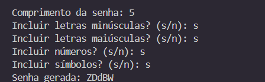

# ⋆｡‧˚ʚ🔐ɞ˚‧｡⋆ Gerador de Senhas Seguras
O Gerador de Senhas Seguras é uma aplicação em Ruby que permite criar senhas fortes e personalizadas de forma rápida e prática! 🧑‍💻💪
Ideal para quem quer manter contas mais seguras, escolhendo o comprimento da senha e os tipos de caracteres desejados.

# ⋆˙⟡📸⋆˙⟡ Screenshots

# ⋆.˚✮🎧✮˚.⋆ Funcionalidades

✅ Geração de senhas personalizadas

🔠 Escolha entre letras minúsculas, maiúsculas, números e símbolos

🛡️ Senhas seguras e aleatórias

🖥️ Interface via terminal (CLI)

⚡ Simples e rápido de executar

# ‧₊ ᵎᵎ 🍒 ⋅ ˚✮ Tecnologias Utilizadas

💎 Ruby

💻 Terminal / CLI

# ˚.🎀༘⋆ Como rodar o projeto

1️⃣ Clone o repositório:
git clone https://github.com/maryavila/gerador-de-senhas.git

2️⃣ Acesse a pasta do projeto:
cd gerador-de-senhas

3️⃣ Execute o programa:
ruby senhas.rb

4️⃣ Siga as instruções no terminal e gere sua senha segura! 

# ⭒₊ ⊹📌 Autora

Desenvolvido com 💻❤️ por Mary
